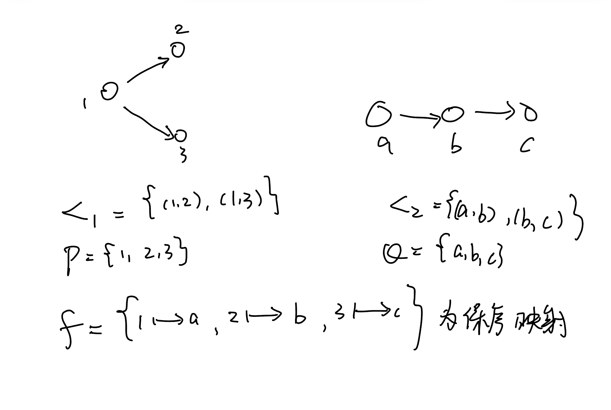

# 序之间的映射
## 保序映射
### 直观上
对于两个序结构 $(P,<_1),(Q,<_2)$，我们考虑保持序结构的映射，即在 $P$ 中有 $x <_1 y$ ，蕴含 $f(x) <_2 f(y)$ 这就是保持集合上序结构的映射。

考虑直观情形：
对于保序映射 $f:P \rightarrow Q$，像集 $f[P]$
若 $f$ 单，则一定有 $P$ 到 $f[P]$ 的双射 $f$ 
由于双射的直观是一种重命名，所以我们可以完全复制 $P$ 上的结构到 $f[P]$ 上。
我们定义 $f[P]$ 上的序关系（你来验证）：
$x <_1 y \Leftrightarrow f(x) <_1' f(y)$
则我们有 $<_1' \subset <_2$，故 $<_2$ 可以看作是 $<_1'$ 的延拓。

对于一般的情况，
考虑映射的结构定理，$\sim = \{ (x,y) : f(x) = f(y)\}$
$f = \varphi \circ \pi$
$\pi : P \rightarrow P/\sim , \varphi : P/\sim \rightarrow f[P]$
容易看出来，位于同一个 $\sim$ 等价类的元素（即属于 $P/\sim$ 同一个元素的元素）两两之间不可比较。而且我们可以定义 $P/\sim $ 上的序 
$[x] <_1' [y]$ 当且仅当 $x <_1 y$

这样能定义的原因大概是 $f$ 保持了序结构，所以我们可以在这个商集中定义序关系。
然后由于 $\varphi$ 是双射，我们自然可以定义 $f[P]$ 上与 $<_1'$ 长得一样的序结构 $<_1''$。
最后可以注意到 $<_1'' \subset <_2$

对于 $\pi$ 这个映射，有一个有趣的情景。
考虑广东省所有公务员集体去北京开会，现在要安排出行车辆，每辆车的等级不一样，要求如果a是b的领导，那么a坐的车必须比b要等级高。那深圳市统计局某科员坐的车显然比深圳市市委书记坐的车低级，但是深圳市市委书记有可能和广东省公安厅长做一辆车，甚至市委书记坐的车要更低级，这是因为他们谁也不是谁的领导，坐车的等级不需要分出高低。
公务员的领导层级可能很复杂，是一个偏序，但是车的等级排序可能只是一个线序，比如按价格排序。这种情况我们就损失了一部分序的信息。
比如你一个东莞市市委书记，正厅级和我一个小小科员坐一辆车都是很有可能的，那书记肯定觉得很委屈，但是没办法，这个商集就是损失了这些信息。 

一些例子： $\mathrm{card}:(P(X),\in) \rightarrow (\mathbb{N},<)$ 是一个保序映射
$\mathrm{id}:(\mathbb{N}^+,|) \rightarrow (\mathbb{N}^+,<)$ 也是
## 保序同构
### 直观上
就是两个序结构要长得一模一样，这意味着他们之间就是互相重命名的关系。
然而与之前的群同态、线性同构不一样的是，只要求 $f$ 是保序映射且是双射是不够的，我们考虑把 $P,Q$ 都放到统一的一个集合 $R$ 上讨论，我们要求 $\varphi_1: P \rightarrow R$ 是双射，且 $\varphi_2 = f\circ \varphi_1^{-1}$，显然也是双射。且 $f = \varphi_2 \circ \varphi_1$
定义 $x <_1 y \Leftrightarrow \varphi_1(x) <_1' \varphi_1 (y)$ 
$x <_2 y \Leftrightarrow \varphi_2 (x) <_2'\varphi_2(y)$
$f$ 保序意味着 $<_1' \subset <_2'$，但是我们想要的是 $<_1' = <_2'$，这也就是两个序长得一样，那么我们还需要 $f^{-1}$ 是一个保序映射。

比如 $\mathrm{id}:(\mathbb{N}^+,|) \rightarrow (\mathbb{N}^+,<)$ 就不是我们想看到的情况

所以就类似